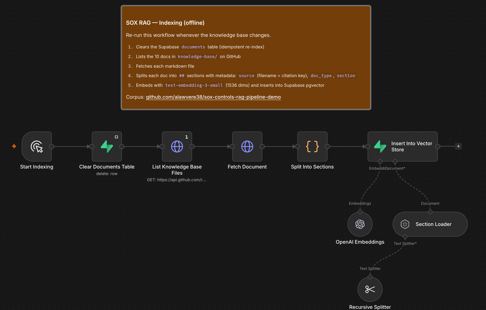
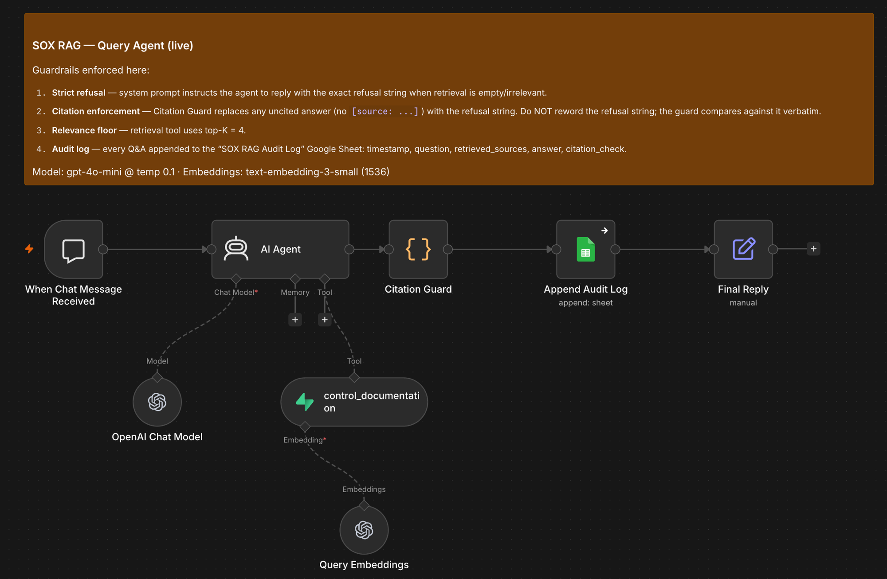
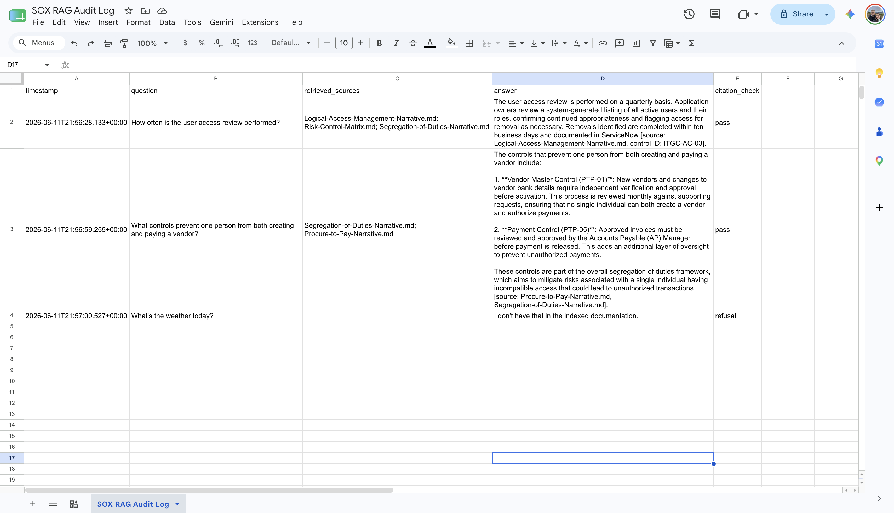
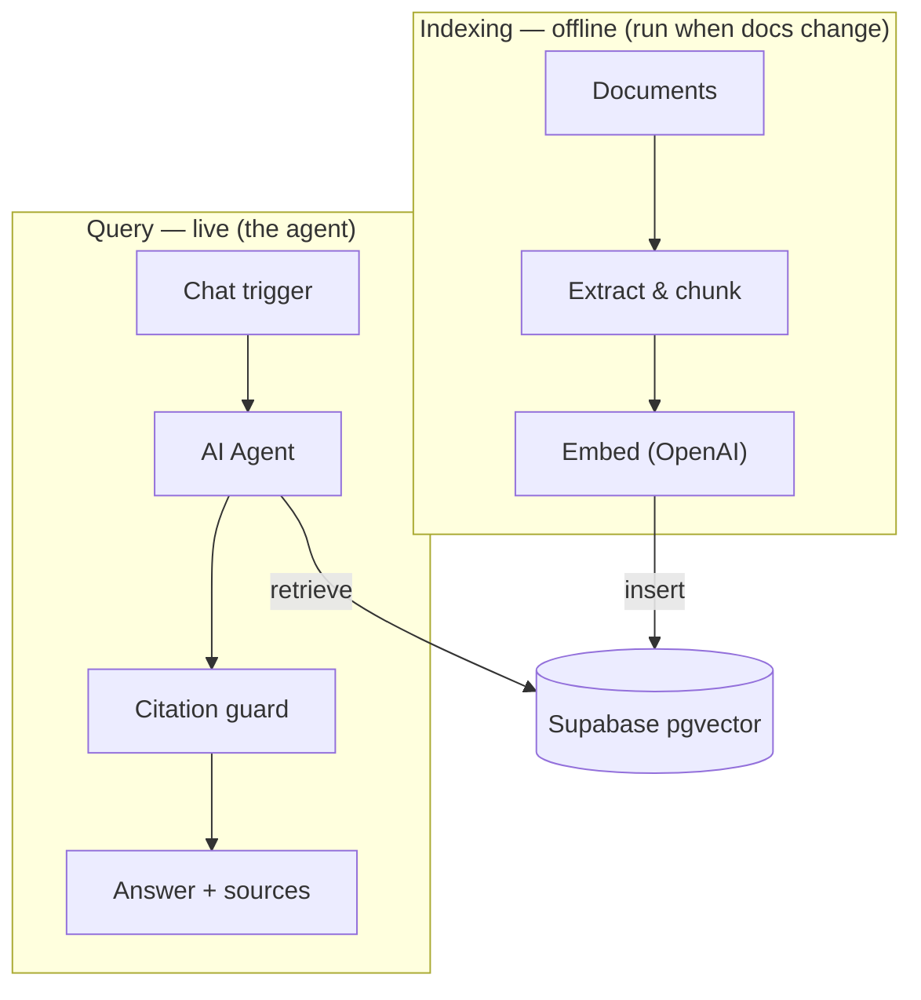

# SOX Controls RAG Pipeline

A retrieval-augmented (RAG) chat agent, built in n8n, that answers questions about a SOX /
ITGC control environment using **only** the indexed source documentation — and cites the source
document for every claim, or refuses when the answer isn't in the corpus.

> **All documentation in this repo is synthetic.** It describes a fictional company,
> *Crestline Manufacturing, Inc.*, and contains no real, proprietary, or employer data. It exists
> to demonstrate the pipeline on realistic-looking material.

## What it does

- Indexes a corpus of control narratives, a security policy, business-process narratives, and a
  risk-and-control matrix into a vector store.
- Answers natural-language questions ("How often is the user access review performed?") grounded in
  that corpus.
- Enforces two guardrails: every answered question is **source-attributed**, and any out-of-scope
  question gets a **strict refusal** rather than a hallucinated answer.

## The live pipeline

The system runs as two n8n workflows against a Supabase pgvector store, with a Google Sheets
audit log capturing every interaction.

### 1. Indexing (offline)

Run whenever the knowledge base changes: it clears the Supabase `documents` table, fetches the
10 knowledge-base files from this repo, splits them into sections with `source` / `doc_type` /
`section` metadata, embeds each chunk with `text-embedding-3-small`, and inserts the vectors
into pgvector. The last run produced 50+ section-level chunks from the 10 documents.



### 2. Query agent (live)

A chat-triggered Tools Agent (`gpt-4o-mini`, temperature 0.1) with the Supabase vector store
attached as a retrieval tool (top-K 4). After the agent answers, a **Citation Guard** code node
verifies the answer carries a `[source: ...]` citation — uncited answers are replaced with the
strict refusal string — and every exchange is appended to the audit log before the reply is
returned.



### 3. Audit trail

Every query is logged with `timestamp, question, retrieved_sources, answer, citation_check`.
The three rows below are the live test runs: an in-scope question (cited, `pass`), a
cross-document segregation-of-duties question (cited, `pass`), and an out-of-scope question
(strict refusal, `refusal`).



### Test results

| Question | Behavior |
|---|---|
| *"How often is the user access review performed?"* | Quarterly, citing control `ITGC-AC-03` with `[source: Logical-Access-Management-Narrative.md]` |
| *"What controls prevent one person from both creating and paying a vendor?"* | Cross-document answer citing `PTP-01` / `PTP-05` from Segregation-of-Duties + Procure-to-Pay narratives |
| *"What's the weather today?"* | `I don't have that in the indexed documentation.` |

## Architecture



## Repo structure

```
sox-controls-rag-pipeline/
  README.md            <- this file
  CLAUDE.md            <- working context for Claude Code
  assets/              <- screenshots of the live workflows and audit log
  knowledge-base/      <- the source documents the pipeline indexes (point n8n here)
  agent/               <- versioned copy of the agent's system prompt (runtime copy lives in n8n)
  evals/               <- golden eval set + regression harness (see "Evaluation harness")
  supabase-setup.sql   <- one-time pgvector table + match_documents function
  .env.example         <- template for local secrets (webhook URL, OpenAI key)
```

Keep `README.md` and `CLAUDE.md` out of the indexed folder so they aren't embedded into the
knowledge base — only the files in `knowledge-base/` should be indexed.

## Document set

| Document | What it covers |
|---|---|
| Logical-Access-Management-Narrative | Provisioning, terminations, access reviews, authentication |
| Change-Management-Narrative | Change authorization, testing, migration SoD, emergency changes |
| Computer-Operations-Narrative | Batch job scheduling, monitoring, failure resolution, interfaces |
| Backup-and-Recovery-Narrative | Backup scheduling, monitoring, restoration testing, offsite |
| Information-Security-Policy | Authentication, passwords, least privilege, data classification |
| Segregation-of-Duties-Narrative | SoD ruleset, conflict review, privileged access & monitoring |
| Order-to-Cash-Narrative | Credit, order entry, revenue recognition, AR reconciliation |
| Procure-to-Pay-Narrative | Vendor master, three-way match, payment approval, AP recon |
| Financial-Close-and-Consolidation-Narrative | Journals, reconciliations, consolidation, FS review |
| Risk-Control-Matrix | Tabular summary of all key controls, cross-referencing the narratives |

## Tech stack

- **n8n** — orchestration (AI Agent + Supabase Vector Store nodes)
- **OpenAI** — `gpt-4o-mini` (chat), `text-embedding-3-small` (embeddings, 1536 dims)
- **Supabase / pgvector** — vector store + `match_documents` similarity function
- **Google Sheets** — compliance audit log

## Guardrails

1. **Strict refusal** — if retrieval returns nothing relevant, the agent replies exactly:
   `I don't have that in the indexed documentation.`
2. **Citation enforcement** — a post-agent check confirms each answer carries a `[source: ...]`
   citation; uncited answers are replaced with the refusal.
3. **Relevance floor** — low top-K (4) and an optional similarity threshold keep weak matches out.
4. **Audit log** — every query, retrieved sources, answer, and citation-check result is logged.

## Evaluation harness

A repeatable regression suite that scores the live agent on five metrics:

| Metric | How it's scored |
|---|---|
| Refusal correctness | Deterministic — exact match against the strict refusal string |
| Citation accuracy | Deterministic — cited `[source: ...]` files and control IDs vs. the answer key |
| Retrieval quality | Deterministic — recall of expected source docs among what was actually retrieved |
| Groundedness | LLM judge — every claim in the answer supported by the retrieved chunks |
| Answer correctness | LLM judge — every expected key fact conveyed by the answer |

The golden set (`evals/dataset.jsonl`, validated against the corpus by
`evals/validate_dataset.py`) holds 24 questions across five categories: single-control,
process-level, cross-document, out-of-scope, and not-in-corpus (the last two expect the exact
refusal). All agent calls go through one adapter (`evals/adapter.py: query_agent`), so the
harness can be repointed away from the n8n webhook by editing a single function. The judge
prompts are versioned files in `evals/prompts/`; the judge model is `gpt-4o-mini` at
temperature 0.

```bash
pip install -r requirements.txt
cp .env.example .env       # fill in the chat webhook URL + OpenAI key

python3 -m evals.validate_dataset            # golden set consistent with the corpus?
python3 -m pytest evals/                     # offline unit tests for the scorers
python3 -m evals.run_evals                   # full scored run -> evals/runs/run-<ts>.json + .md
python3 -m evals.run_evals --no-judge        # deterministic checks only (no OpenAI key needed)
```

Each run writes a JSON result file and a markdown report (overall, per-category, per-check,
per-item). To catch regressions, pin a known-good run as the baseline and diff against it —
the runner exits non-zero if any previously passing item now fails:

```bash
cp evals/runs/run-<ts>.json evals/baseline.json
python3 -m evals.run_evals --baseline evals/baseline.json
```

## Data handling

Only the synthetic `knowledge-base/` documents belong in this repo. Do not index real internal
control documentation into a public or shared instance; classify and host sensitive material in a
private environment.
