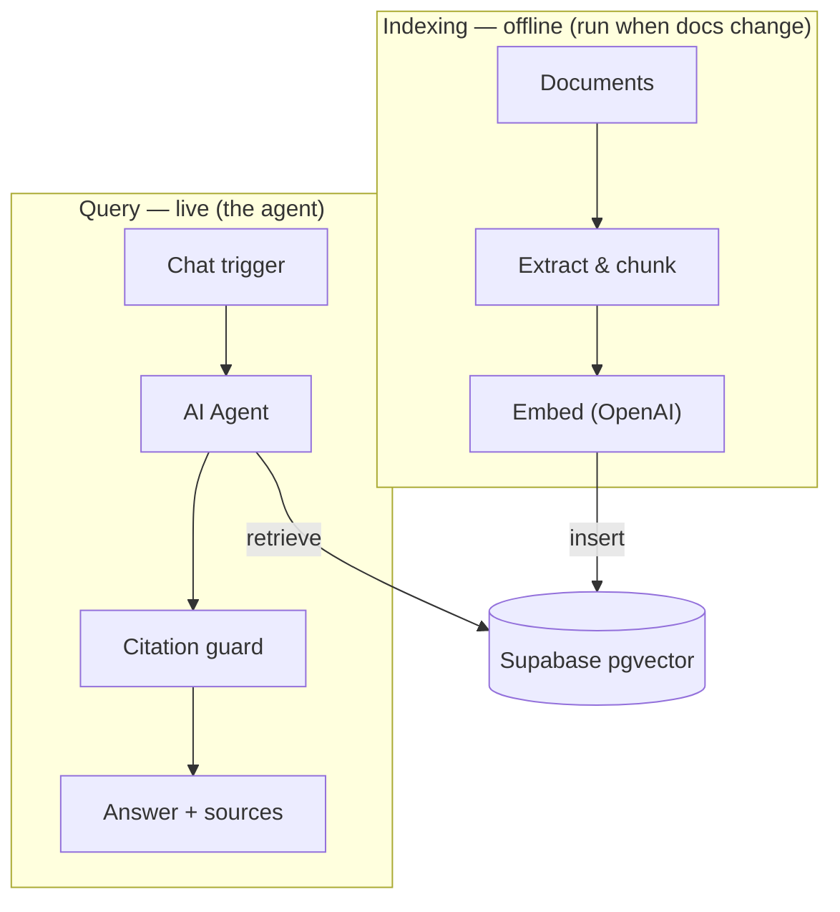

# SOX Controls RAG Pipeline

A retrieval-augmented (RAG) chat agent, built in n8n, that answers questions about a SOX /
ITGC control environment using **only** the indexed source documentation — and cites the source
document for every claim, or refuses when the answer isn't in the corpus.

> **All documentation in this repo is synthetic.** It describes a fictional company,
> *Crestline Manufacturing, Inc.*, and contains no real, proprietary, or employer data. It exists
> to demonstrate the pipeline on realistic-looking material.

## What it does

- Indexes a corpus of control narratives, a security policy, business-process narratives, and a
  risk-and-control matrix into a vector store.
- Answers natural-language questions ("How often is the user access review performed?") grounded in
  that corpus.
- Enforces two guardrails: every answered question is **source-attributed**, and any out-of-scope
  question gets a **strict refusal** rather than a hallucinated answer.

## Architecture



## Repo structure

```
sox-controls-rag-pipeline/
  README.md            <- this file
  CLAUDE.md            <- working context for Claude Code
  knowledge-base/      <- the source documents the pipeline indexes (point n8n here)
```

Keep `README.md` and `CLAUDE.md` out of the indexed folder so they aren't embedded into the
knowledge base — only the files in `knowledge-base/` should be indexed.

## Document set

| Document | What it covers |
|---|---|
| Logical-Access-Management-Narrative | Provisioning, terminations, access reviews, authentication |
| Change-Management-Narrative | Change authorization, testing, migration SoD, emergency changes |
| Computer-Operations-Narrative | Batch job scheduling, monitoring, failure resolution, interfaces |
| Backup-and-Recovery-Narrative | Backup scheduling, monitoring, restoration testing, offsite |
| Information-Security-Policy | Authentication, passwords, least privilege, data classification |
| Segregation-of-Duties-Narrative | SoD ruleset, conflict review, privileged access & monitoring |
| Order-to-Cash-Narrative | Credit, order entry, revenue recognition, AR reconciliation |
| Procure-to-Pay-Narrative | Vendor master, three-way match, payment approval, AP recon |
| Financial-Close-and-Consolidation-Narrative | Journals, reconciliations, consolidation, FS review |
| Risk-Control-Matrix | Tabular summary of all key controls, cross-referencing the narratives |

## Tech stack

- **n8n** — orchestration (AI Agent + Supabase Vector Store nodes)
- **OpenAI** — `gpt-4o-mini` (chat), `text-embedding-3-small` (embeddings, 1536 dims)
- **Supabase / pgvector** — vector store + `match_documents` similarity function

## Guardrails

1. **Strict refusal** — if retrieval returns nothing relevant, the agent replies exactly:
   `I don't have that in the indexed documentation.`
2. **Citation enforcement** — a post-agent check confirms each answer carries a `[source: ...]`
   citation; uncited answers are replaced with the refusal.
3. **Relevance floor** — low top-K (4) and an optional similarity threshold keep weak matches out.
4. **Audit log** — every query, retrieved sources, answer, and citation-check result is logged.

## Demo questions

- In-scope: *"How often is the user access review performed?"* → cites AC-03 (quarterly).
- Cross-document: *"What controls prevent one person from both creating and paying a vendor?"*
  → pulls from Segregation of Duties + Procure-to-Pay.
- Out-of-scope: *"What's the weather today?"* → strict refusal.

## Data handling

Only the synthetic `knowledge-base/` documents belong in this repo. Do not index real internal
control documentation into a public or shared instance; classify and host sensitive material in a
private environment.
